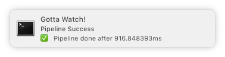

Gotta Watch Your Code!
======================

  

GOTTA WATCH watches your code and builds it whenever you save a file. 

## Getting Started

Right now, `gottaw` requires `golang >= 1.7` to be built. To install it, from source, 
just execute 

    $ go get github.com/makii42/gottaw

Once that hurdle is taken, you can use it with your code project. Go to the root 
of your code and have `gottaw` suggest what language it might be:

    $ gottaw defaults
    🔬  evaluating /home/user/go/src/github.com/makii42/gottaw
    🎯  Identified default Golang

You can generate a default config file by passing an additional `--write` flag:

    $ gottaw defaults -w
    🔬  evaluating /Users/ralfischer/go/src/github.com/diegogub/aranGO
    🎯  Identified default Golang
    Default config for Golang:
    ===
    workdir: ""
    excludes:
    - .git
    - .hg
    - .vscode
    - .idea
    - .gitrecinfo
    - '*-go-tmp-umask'
    pipeline:
    - go get -v .
    - go build -v .
    - go test -v ./...
    growl: false
    server: ""
    ===
    Write to './.gottaw.yml'? [y/N] y
    ✅  Okay!

With that, you should be good to go. Once you run `gottaw` in that directory, it will 
execute your pipeline whenever a file changes. As it does not discriminate anything, 
you might need to add excludes depending on your project.

## Configuration

Gottaw configuration allows you to configure your **pipeline steps** and 
**excluded files** that should not trigger a new build. It also allows you also to specify
a **server command** that is stopped before each build and started after a successful 
pipeline execution.

### Pipeline steps

For a go library or command, the above default should suffice. For the node/npm default, 
a pipeline could look like this:

    pipeline: 
    - npm install
    - npm test

The pipeline definition is a simple list of commands. The execution propagates the
full environment of your shell. If you need build- or folder-specific environment 
variables, I suggest using [direnv](https://direnv.net/). 

## Excludes

Most build systems create files like binaries or dependencies in the working directory. You 
need to specify them in order to avoid triggering a build loop. Also your $EDITOR or $IDE
keep state in a folder or file(s) that your build does not care about. For a Java build, 
the exclude typically are the `target` folder. In multi-module builds, we also should exclude 
the submodules' `target`:

    excludes:
    - target
    - */target

Excludes have limited globbing capability. If in doubt, add more. This is something that 
could be improved at some point.

## Workdir

By default, `gottaw` executes each pipeline step in the current folder where it was 
executed. If want to execute the commands in a different folder, set a working dir:

    workdir: ./foo/bar

## servrer command

Often you work on a server process that you obviously want to test after your build was 
successful. `gottaw` does that for you as well! By specifying a `server` element in your 
configuration, it will start the command after a successful build and keep it running
until you change something else. Then it will stop the command, execute the pipeline and 
fire it up again. 

For a nodejs / express app built with [yarn](https://github.com/yarnpkg) , this could 
simply be this:

    excludes: 
    - .git
    - node_modules
    pipeline: 
    - yarn install
    - yarn test
    server: yarn start

So after safe, just switch to your browser and refresh!

## Growl support

`gottaw` can also *growl* the build result to your OS, so you don't need to watch the terminal
for a success message. To enable it, just set

    growl: true

Et voila:

## Features

Some of the recent changes:

- [x] Auto-Track addition and removal of folders
- [x] Auto-Reload config if config file is changed
- [x] Growl support
- [x] Pre-define sensible defaults for various setups (go, node, ... )
- [x] Server process auto-start/stop support

Obviously it still needs a LOT of polish. I don't have a lot on the agenda 
except optimizations. I'd be especially grateful if someone on Windows 
takes a look on the build and defaults...

PRs Welcome!